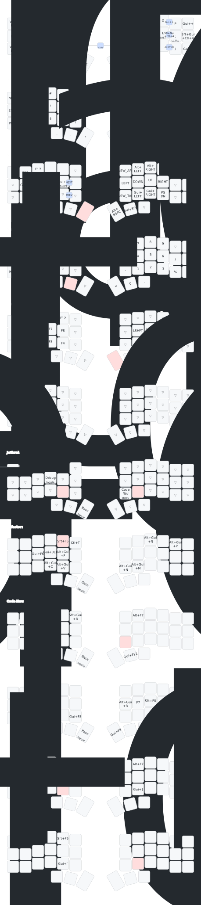

# ZMK Corne Unified Keymap

This repo contains the keymap config for each of my 3 Corne variants (Corne MX, Corne-ish Zen and CorneRoll).

It's heavily influenced by Miryoku.




```sh
docker compose run zmk-build
```

```sh
./build.sh charma seeeduino_xiao_ble

```

In Docker:
docker run --rm --volume /Users/ally/src/allymparker/zmk-config-unified:/keymap --workdir=/keymap -t zmkfirmware/zmk-build-arm:3.5-branch /bin/bash